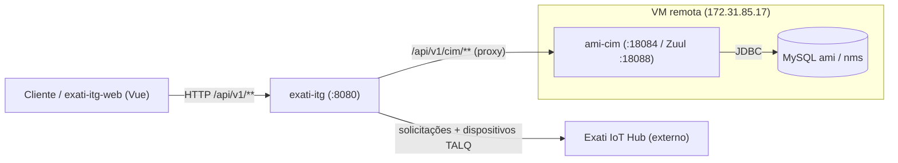
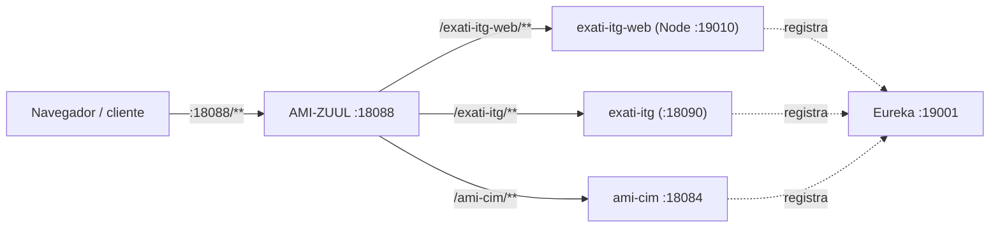

# exati-itg — Guia de Integração

Como o **`exati-itg`** (nosso serviço de integração) se encaixa no ambiente: quem chama ele, e como ele conversa com a plataforma de iluminação pública AMI e com o Exati IoT Hub.

> **O que é o `exati-itg`:** uma **API de integração/middleware** enxuta (Spring Boot 3, Java 21). Ele não é dono dos dados de iluminação — faz a ponte entre o **Exati IoT Hub** (plataforma TALQ, para onde enviamos solicitações e anúncios de dispositivos) e a **plataforma AMI** (o sistema Sanxing que gerencia as luminárias, com os bancos MySQL `ami`/`nms`). Sua persistência própria é só um H2 em memória (usuários/JWT) — **não** é o banco de iluminação.

---

## 1. Visão geral da arquitetura



**Ponto-chave do nosso lado:** o `exati-itg` **não acessa o MySQL diretamente**. Quem lê/escreve no banco `ami`/`nms` é o microserviço **`ami-cim`**; o `exati-itg` apenas encaminha as chamadas para ele.

---

## 2. Chamando a API do `exati-itg`

**URL base:** `http://<host>:8080` (dev); atrás do gateway AMI‑ZUUL no ambiente implantado.
**Formato:** JSON. Erros no padrão RFC 7807 (`application/problem+json`).
**Autenticação:** JWT bearer (`/api/v1/auth/login` → `Authorization: Bearer <token>`).

| Área | Endpoint | Para quê |
|---|---|---|
| Autenticação | `POST /api/v1/auth/login`, `/register` | Obter JWT |
| Solicitações | `POST` / `DELETE /api/v1/solicitacoes` | Criar/cancelar solicitação (vai ao Exati) |
| Dispositivos TALQ | `POST/GET /api/v1/talq/devices`, `/device-classes` | Anunciar/consultar luminárias e classes |
| Plataforma AMI | `* /api/v1/cim/**` | Proxy transparente para o `ami-cim` |

Documentação interativa: **Swagger UI** em `/swagger-ui.html`.

---

## 3. Como o `exati-itg` fala com a plataforma/banco AMI  *(o nosso lado da integração)*

Este é o coração da integração no nosso lado. O acesso ao banco é **indireto, via `ami-cim`**:

```
sua chamada ──► /api/v1/cim/<resto>      (exati-itg, CimProxyController)
            ──► {CIM_BASE_URL}/<resto>    (encaminha método, query, corpo e Authorization sem alterar)
            ──► ami-cim                    (:18084, ou via AMI-ZUUL :18088)
            ──► MySQL ami / nms            (o ami-cim é dono da conexão JDBC)
```

- O `CimProxyController` é **agnóstico de contrato**: tudo sob `/api/v1/cim/**` é repassado sem alteração e a resposta volta intacta. Uma única rota cobre todas as ~28 rotas do CIM.
- Alvo configurável em **`CIM_BASE_URL`** (padrão `http://localhost:18084/ami/cim`; aponte para o Zuul `:18088` no ambiente da VM).

**O banco** (detalhado na enciclopédia de esquema em `../../EXATI/docs/README.md`):

| | |
|---|---|
| Host | `172.31.85.17:3306` (interno) / `34.232.210.135` (só a partir da VM — use túnel SSH para inspecionar) |
| Bancos | `ami` (medição/negócio — luminárias modeladas como medidores) e `nms` (rede RF) |
| Credenciais | usuário `ami` — via variável de ambiente/segredo, **nunca no código** |
| Dono | os serviços AMI (`ami-cim`, `ami-ops`…), **não** o `exati-itg` |

**Do conceito Exati/TALQ para a tabela AMI** (o que uma operação acaba tocando no banco):

| Conceito | Tabela AMI |
|---|---|
| Luminária / dispositivo | `archive_meter` (luminária = medidor), `archive_slc`, `archive_poc` |
| Acender/apagar | `ops_manual_switch_relay` / `ops_auto_switch_relay` (relé) |
| Gateway / concentrador | `nms_gateway`; módulo por luminária `nms_leaf_node_module` |
| Status / disponibilidade | `monitor_online_info`, `monitor_meter_status` |
| Instalação/troca em campo | `fdm_work_order*` |

### Ciclo de vida de uma luminária (medidor) no banco

Quando uma luminária é **cadastrada** ou **atualizada** (via CIM/TALQ, executado pelo `ami-cim`), estas são as tabelas afetadas. O próprio log de status do banco confirma o fluxo — as amostras trazem transições como *"Meter Create"*, *"Bind POC"* e *"Warehouse → Installed → Active"*.

**Cadastro (novos registros):**
- `archive_meter` — registro mestre da luminária: novo `meter_no` (chave única), `org_no`, `dcu_no`, `meter_type_id`, `sim_id`, `latitude`/`longitude`, `install_time`, chaves MK/AK/EK e `meter_status` inicial.
- `archive_meter_key` — conjunto de chaves criptográficas da luminária.
- `archive_meter_status` — 1 linha no log (append-only), `update_type=01` (*"Meter Create" / "Status:Warehouse"*).
- `archive_poc` — ponto de luz vinculado (liga `meter_no` à organização/rede/tarifa); o vínculo gera outra linha de log (`update_type=03`, *"Bind POC"*).
- `archive_param_item_meter` — parâmetros do dispositivo.
- `nms_leaf_node_module` (banco `nms`) — módulo de comunicação da luminária, ligado ao concentrador via `gateway_no`.
- *(opcional — campo/app)* `fdm_work_order_install` + `log_change_meter_list`, e o espelho `app_archive_meter`.

**Atualização (UPDATE + novos logs):**
- `archive_meter` — `UPDATE` dos campos alterados, mais `update_time`/`update_user`.
- `archive_meter_status` — **nova linha** de log a cada transição (*"Warehouse → Installed"*, *"Installed → Active"*, *"Bind Profile"*).
- `archive_meter_status_volume` — atualiza `relay_status`/`relay_status_updtime` quando a luminária é **acesa/apagada** (disparado por `ops_*switch_relay`, ver 03-operations.md).
- *(opcional)* `app_update_archive_meter` (fila de sincronização do app); `log_change_meter_list` em caso de **troca física** da luminária.
- Monitoramento: `monitor_meter_status` (mudança de estado) e `monitor_meter_phase_record` (mudança de fase).

> **Quem escreve:** essas gravações são feitas pela plataforma AMI (`ami-cim`), **não** pelo `exati-itg`. O conjunto acima é inferido do esquema (contagens de linhas + o conteúdo do log de status confirmam o fluxo) — detalhe de colunas em `../../EXATI/docs/01-device-registry.md`.

> Se um dia for preciso acesso **direto** ao banco, dá para adicionar um `spring.datasource` apontando para o MySQL — mas o padrão é ir pelo `ami-cim`, mantendo o `exati-itg` sem estado e com as regras de negócio em um só lugar.

---

## 4. Integração com o Exati IoT Hub  *(lado externo — resumo)*

O `exati-itg` também envia dados **para fora**, ao Exati IoT Hub (`EXATI_BASE_URL`, padrão `https://iot.exati.com.br/staging`):

- **Solicitações (tickets):** criar/cancelar demandas de iluminação.
- **Dispositivos TALQ:** anunciar gateway, classes e luminárias.

O detalhamento de rotas, cabeçalhos e payloads desse contrato externo fica com a **documentação oficial da Exati** (`https://docs.iothub.exati.com`). Aqui basta saber que essas chamadas partem do `exati-itg` e são configuradas pelas variáveis `EXATI_*`.

---

## 5. Configuração (variáveis de ambiente)

| Variável | Padrão | Significado |
|---|---|---|
| `CIM_BASE_URL` | `http://localhost:18084/ami/cim` | Alvo do `ami-cim` (ou Zuul `:18088`) — **a integração com o AMI** |
| `EXATI_BASE_URL` | `https://iot.exati.com.br/staging` | URL do Exati IoT Hub |
| `EXATI_ID_INSTANCE` | `69` | Id da instância do cliente |
| `EXATI_AUTH_TYPE` / `_TOKEN` / `_KEY` | `none` | Autenticação de saída para o Exati |
| `SERVER_PORT` | `8080` | Porta HTTP |

---

## 6. Produção — Eureka + Zuul

Em produção, tudo roda na VM sob o mesmo mecanismo de descoberta usado pelos serviços AMI: um **registro Eureka** (`:19001`) e o **gateway AMI‑ZUUL** (`:18088`). O padrão é simples: **cada serviço se registra no Eureka e o Zuul roteia `http://3.88.22.232:18088/{nome-do-serviço}/**` automaticamente para ele.** O Eureka só *registra* (mantém a lista viva por heartbeats) — ele não executa nada; quem sobe e mantém o processo é o gerenciador de serviço (systemd/pm2).



**Como cada peça entra no gateway:**

1. **Frontend `exati-itg-web`** — já resolvido: o servidor Node se registra no Eureka (via `eureka-js-client`) e o Zuul roteia `/exati-itg-web/**` (ver `../../exati-itg-web/server/`). Buildar com `VITE_BASE=/exati-itg-web/`.

2. **Backend `exati-itg`** — para seguir o padrão ele precisa **se registrar no Eureka como `EXATI-ITG`**. Hoje é um Spring Boot puro, **sem cliente Eureka**; falta:
   - adicionar a dependência `spring-cloud-starter-netflix-eureka-client` (compatível com o Spring Cloud da stack — era Zuul, então linha Hoxton/2021.x);
   - `eureka.client.service-url.defaultZone=http://172.31.85.17:19001/eureka/` e `spring.application.name=exati-itg`;
   - rodar em **porta livre** (ex.: `18090`) — **não** use `8080`, já ocupada pelo `AMI-PROTOCOL`.
   
   Feito isso, o Zuul expõe automaticamente em `http://3.88.22.232:18088/exati-itg/**`.

3. **`exati-itg` → `ami-cim`** — em produção aponte `CIM_BASE_URL` para o **Zuul** (`http://172.31.85.17:18088/ami-cim/ami/cim`) em vez de `host:porta` fixo, aproveitando o service discovery.

**Configuração de produção (variáveis principais):**

| Variável | Valor de produção |
|---|---|
| `EUREKA_URI` / `defaultZone` | `http://172.31.85.17:19001/eureka/` |
| `SERVER_PORT` | `18090` (porta livre) |
| `CIM_BASE_URL` | `http://172.31.85.17:18088/ami-cim/ami/cim` (via Zuul) |
| `EXATI_BASE_URL` + `EXATI_AUTH_*` | endpoint + credenciais reais do Exati IoT Hub |

**Verificação:**
```bash
# registrado no Eureka?
curl -s http://localhost:19001/eureka/apps/EXATI-ITG -H 'Accept: application/json' | head -c 800; echo
# acessível pelo gateway?
curl -s http://3.88.22.232:18088/exati-itg/actuator/health
```
Enquanto o processo estiver vivo e mandando heartbeats, o Zuul roteia; se ele cair, o Eureka o remove em ~15s e o gateway para de encaminhar. Rode o serviço sob **systemd/pm2** (como os demais) para garantir restart e boot.
