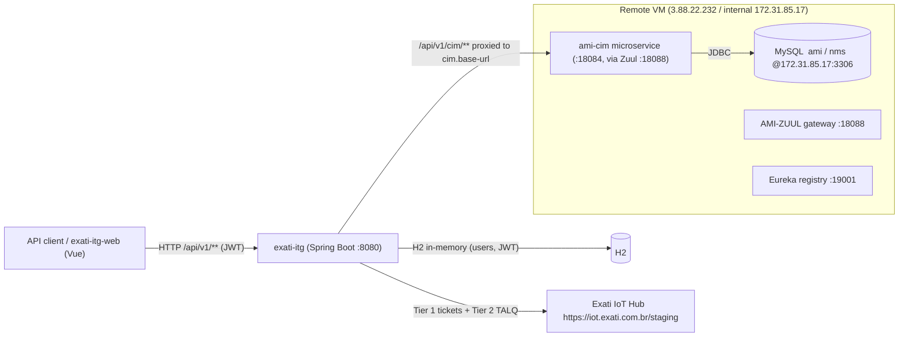

# exati-itg — Integration Guide

How to integrate **with** the `exati-itg` API, and how `exati-itg` communicates **outward** to the Exati IoT Hub and to the AMI street-lighting platform / its MySQL database.

> **What `exati-itg` is:** a thin **integration/middleware API** (Spring Boot 3, Java 21). It does not own the lighting data — it bridges two worlds:
> 1. the **Exati IoT Hub** (a TALQ Smart-City platform: *solicitações*/tickets + device modeling), and
> 2. the **AMI platform** (the Sanxing system that actually manages the street lamps, backed by the MySQL `ami`/`nms` databases).
>
> Its own persistence (users/JWT, etc.) is a small **H2 in-memory** store — **not** the lighting database.

---

## 1. Architecture at a glance



**Key point:** the arrow into MySQL goes **through `ami-cim`**, never directly from `exati-itg`. `exati-itg` speaks the CIM REST contract; `ami-cim` is what reads/writes the `ami` database.

---

## 2. Integrating WITH the `exati-itg` API (inbound)

**Base URL:** `http://<host>:8080` (dev). In the deployed stack it sits behind the AMI‑ZUUL gateway.

**Content type:** `application/json`. **Errors:** RFC 7807 `application/problem+json` (a `GlobalExceptionHandler` maps every failure to `{type,title,status,detail,...}`).

**Auth:** JWT bearer. Obtain a token from `/api/v1/auth/login`, then send `Authorization: Bearer <token>`.
> ⚠️ **Current state:** JWT enforcement is **temporarily disabled** in `SecurityConfig` (a `TODO(auth)` leaves all routes open). Treat endpoints as *intended* to require a bearer token; wire it before production.

### Endpoints

| Method | Path | Auth | Purpose |
|---|---|---|---|
| `POST` | `/api/v1/auth/register` | open | Create a user → `{tokenType, accessToken, expiresAt, username}` |
| `POST` | `/api/v1/auth/login` | open | Exchange username+password for a JWT |
| `GET`  | `/api/v1/ping` | Bearer | Health sample → `{"message":"pong",...}` |
| `POST` | `/api/v1/solicitacoes` | Bearer | Create a *solicitação* (ticket) → forwarded to Exati Tier 1 |
| `DELETE` | `/api/v1/solicitacoes` | Bearer | Cancel a *solicitação* |
| `POST` | `/api/v1/talq/device-classes` | Bearer | Announce TALQ device classes (Tier 2) |
| `POST` | `/api/v1/talq/devices` | Bearer | Register/announce TALQ devices (Tier 2) |
| `GET`  | `/api/v1/talq/devices` / `/{deviceAddress}` | Bearer | List / get devices |
| `PUT`/`PATCH` | `/api/v1/talq/devices/{deviceAddress}` | Bearer | Update a device |
| `*` | `/api/v1/cim/**` | Bearer | **Transparent proxy** to the `ami-cim` gateway (see §4) |

**Interactive docs:** Swagger UI at `/swagger-ui.html` (OpenAPI 3 via springdoc).

### Example — create a solicitação
```bash
curl -X POST http://<host>:8080/api/v1/solicitacoes \
  -H "Authorization: Bearer <jwt>" -H "Content-Type: application/json" \
  -d '{"id_external_protocol":12345,"service_code":"YOUR_CODE","id_worksite":1}'
```
Required body fields: `id_external_protocol`, `service_code`, `id_worksite` (snake_case). See `CreateTicketRequest` for the full optional field set (location, reporter, etc.).

---

## 3. Outbound integration #1 — Exati IoT Hub (TALQ)

Configured under the `exati.*` tree; base URL default `https://iot.exati.com.br/staging`.

### Tier 1 — Solicitações (`/tickets`)
Per the **updated** IoT Hub docs, the create/cancel endpoints and headers are:

| | Value |
|---|---|
| Create | `POST {base}/tickets` |
| Cancel | `DELETE {base}/tickets` |
| Headers | `apikey: <key>`, `x-id-instance: <instance>`, `x-vendor-uuid: <uuid>` |
| Body (create) | `id_external_protocol`, `service_code`, `id_worksite` (+ optional origin/location/reporter fields) |
| Body (cancel) | `cod_external_ticket_origin`, `id_external_protocol`, `justification` |
| Success | `{ "id_demanda|id_protocolo": …, "operacao": "cria|cancela", "data_recebido": …, "status": "ok" }` |

> ⚠️ **Code drift:** `ExatiTalqClient` currently targets the **older** path `/vendors/talq/clients/{idInstance}/tickets` (instance in the URL) and an `X-Api-Key`/bearer scheme. To match the updated docs it must move `idInstance` into the `x-id-instance` header, add `x-vendor-uuid`, and use the `apikey` header. Track this as a required change.

### Tier 2 — TALQ resource API (device modeling)
Base paths carry **no** `idInstance`; payloads are **arrays**; every call takes optional `?clientAddress={gateway-uuid}`.

| Purpose | Method | Path |
|---|---|---|
| Gateway class announcement | `POST` | `/talq/device-classes` |
| Gateway announcement | `POST` | `/talq/devices` |
| Gateway update | `PATCH` | `/talq/devices/{deviceAddress}` |
| Services announcement | `POST` | `/talq/services` |
| Device (luminaire) classes | `POST` | `/talq/device-classes` |
| Device (luminaire) discovery | `POST` | `/talq/devices` |

Model = TALQ luminaires/gateways with `functions` (`BasicFunction`, `CommunicationFunction`, `GatewayFunction`, `ElectricalMeterFunction`) and attributes like `totalPower`, `totalActiveEnergy`, `supplyVoltage`, and a `Binary` `"ON"/"OFF"` (the light switch). A **bootstrap sequence** governs call order (announce class → gateway → services → device classes → devices).
> ⚠️ `TalqResourceClient` implements device-classes + devices but **not** `/talq/services`, and uses `PUT` where the docs document `PATCH` for updates.

---

## 4. Outbound integration #2 — the AMI platform & its database

This is how `exati-itg` "talks to the database" — **indirectly, through the `ami-cim` microservice.**

### The path
```
your call  ──►  POST/GET/... /api/v1/cim/<rest>          (exati-itg, CimProxyController)
           ──►  {cim.base-url}/<rest>                     (verbatim: method, query, body, Authorization)
           ──►  ami-cim microservice                      (:18084, or via AMI-ZUUL :18088)
           ──►  MySQL  ami / nms  @ 172.31.85.17:3306      (ami-cim owns this JDBC connection)
```
`CimProxyController` is contract-agnostic: it forwards everything under `/api/v1/cim/**` unchanged (including the `Authorization` header so the gateway's own auth still applies) and returns the upstream status/body untouched. So all ~28 CIM routes are covered by one handler — you integrate by calling the CIM routes through this prefix.

- **`cim.base-url`** default `http://localhost:18084/ami/cim` (direct to `ami-cim`); point at `http://172.31.85.17:18088/...` to go through Zuul via `CIM_BASE_URL`.

### The database itself
The MySQL analysed on the VM (documented in the schema encyclopedia at **`../../EXATI/docs/README.md`**):

| | |
|---|---|
| Host | `172.31.85.17:3306` internal / `34.232.210.135:3306` (reachable only from the VM; use an SSH tunnel to inspect) |
| Databases | `ami` (metering/business app — lamps modeled as meters) and `nms` (RF network layer) |
| Credentials | user `ami` — **do not hard-code**; supply via env/secret (they live in `EXATI/dump_schema.sh` for reference) |
| Owner | the AMI platform services (`ami-cim`, `ami-ops`, `ami-protocol`), **not** `exati-itg` |

### Concept → table mapping (Exati/TALQ ↔ AMI DB)
When a CIM/TALQ operation ultimately touches the database, this is roughly what it maps to (see the encyclopedia for column detail):

| Exati / TALQ concept | AMI database entity |
|---|---|
| Luminaire / device (`/talq/devices`) | `archive_meter` (lamp = meter), `archive_slc` (street-lighting controller), `archive_poc` (light point) — *01-device-registry.md*, *02-grid-customers-config.md* |
| Light **ON/OFF** (`Binary`) | `ops_manual_switch_relay` / `ops_auto_switch_relay` (relay switching) — *03-operations.md* |
| Gateway / concentrator | `nms_gateway`; per-lamp comm module `nms_leaf_node_module` — *10-network-management.md* |
| Device status / reachability | `monitor_online_info`, `monitor_meter_status` — *09-monitoring-analysis.md* |
| Electrical attributes (power, energy, voltage) | `data_item` (DLMS/OBIS catalog) + collected readings — *06-data-dictionary.md* |
| Field install/swap of a lamp | `fdm_work_order*` — *07-mobile-fieldwork.md* |

> **If direct DB access is ever required** (rather than via `ami-cim`): add a `spring.datasource` pointing at the MySQL, a JDBC driver, and JPA/Flyway config — but prefer the `ami-cim` API so `exati-itg` stays a stateless integration layer and business rules stay in one place.

---

## 5. Configuration reference (env-overridable)

| Env var | Default | Meaning |
|---|---|---|
| `EXATI_BASE_URL` | `https://iot.exati.com.br/staging` | Exati IoT Hub base |
| `EXATI_ID_INSTANCE` | `69` | Client instance id (→ `x-id-instance`) |
| `EXATI_AUTH_TYPE` | `none` | `none` \| `bearer` \| `apikey` |
| `EXATI_AUTH_TOKEN` / `EXATI_AUTH_KEY` / `EXATI_AUTH_HEADER` | — | Credentials for the chosen scheme (set `apikey` for the updated Tier 1) |
| `CIM_BASE_URL` | `http://localhost:18084/ami/cim` | `ami-cim` target (or point at Zuul `:18088`) |
| `CIM_CONNECT_TIMEOUT_MS` / `CIM_READ_TIMEOUT_MS` | `5000` / `30000` | CIM client timeouts |
| `SERVER_PORT` | `8080` | HTTP port |

---

## 6. Running locally

```bash
./gradlew bootRun        # requires JDK 21
# Swagger UI:      http://localhost:8080/swagger-ui.html
# Health:          http://localhost:8080/actuator/health
```
H2 is in-memory (schema via Flyway, `ddl-auto: none`); no external DB needed to boot. To exercise the CIM proxy or Exati calls locally you need reachability to `ami-cim` / the IoT Hub (or a mock).

---

## 7. Deployment context

`exati-itg` runs on the VM alongside the AMI microservices; the `exati-itg-web` Vue frontend is served separately and registered into Eureka so **AMI-ZUUL** routes `/exati-itg-web/**` to it (see `../../exati-itg-web/server/`). The frontend calls `exati-itg` under `/api`, which in turn fans out to the Exati IoT Hub and the AMI platform as above.

## Current status & gaps (as of this writing)
- 🔴 JWT auth **disabled** (`SecurityConfig` TODO) — all routes open.
- 🔴 `ExatiTalqClient` Tier 1 path/headers **out of date** vs the updated IoT Hub docs (see §3).
- 🟡 `/talq/services` **not implemented**; device update uses `PUT` vs documented `PATCH`.
- 🟡 Persistence is **H2 in-memory** — nothing is durable across restarts yet.
- 🟢 CIM passthrough (`/api/v1/cim/**`) is complete and contract-agnostic.
