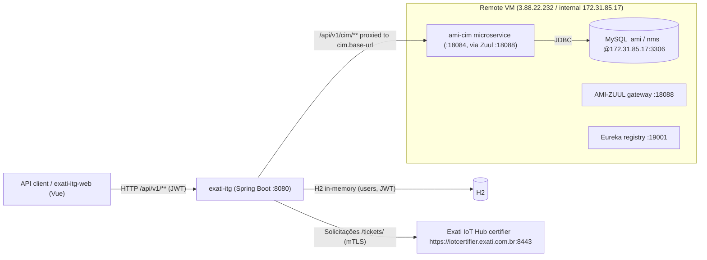

# exati-itg — Integration Guide

How to integrate **with** the `exati-itg` API, and how `exati-itg` communicates **outward** to the Exati IoT Hub and to the AMI street-lighting platform / its MySQL database.

> **What `exati-itg` is:** a thin **integration/middleware API** (Spring Boot 3, Java 21). It does not own the lighting data — it bridges two worlds:
> 1. the **Exati IoT Hub** (a TALQ Smart-City platform: *solicitações*/tickets + device modeling), and
> 2. the **AMI platform** (the Sanxing system that actually manages the street lamps, backed by the MySQL `ami`/`nms` databases).
>
> Its own persistence (users/JWT, etc.) is a small **H2 in-memory** store — **not** the lighting database.

---

## 1. Architecture at a glance



**Key point:** the arrow into MySQL goes **through `ami-cim`**, never directly from `exati-itg`. `exati-itg` speaks the CIM REST contract; `ami-cim` is what reads/writes the `ami` database.

---

## 2. Integrating WITH the `exati-itg` API (inbound)

**Base URL:** `http://<host>:8080` (dev). In the deployed stack it sits behind the AMI‑ZUUL gateway.

**Content type:** `application/json`. **Errors:** RFC 7807 `application/problem+json` (a `GlobalExceptionHandler` maps every failure to `{type,title,status,detail,...}`).

**Auth:** JWT bearer. Obtain a token from `/api/v1/auth/login`, then send `Authorization: Bearer <token>`.
> ⚠️ **Current state:** JWT enforcement is **temporarily disabled** in `SecurityConfig` (a `TODO(auth)` leaves all routes open). Treat endpoints as *intended* to require a bearer token; wire it before production.

### Endpoints

| Method | Path | Auth | Purpose |
|---|---|---|---|
| `POST` | `/api/v1/auth/register` | open | Create a user → `{tokenType, accessToken, expiresAt, username}` |
| `POST` | `/api/v1/auth/login` | open | Exchange username+password for a JWT |
| `GET`  | `/api/v1/ping` | Bearer | Health sample → `{"message":"pong",...}` |
| `POST` | `/api/v1/solicitacoes` | Bearer | Create a *solicitação* (ticket) → forwarded to the Exati Solicitações API (mirrors upstream 201 created / 200 idempotent) |
| `GET`  | `/api/v1/solicitacoes` | Bearer | Query *solicitações* (`limit`, `page`, `deviceUuid`, `status`, `dateFrom`, `dateTo`) |
| `DELETE` | `/api/v1/solicitacoes` | Bearer | Cancel a *solicitação* |
| `POST` | `/api/v1/talq/device-classes` | Bearer | Announce TALQ device classes (Tier 2) |
| `POST` | `/api/v1/talq/devices` | Bearer | Register/announce TALQ devices (Tier 2) |
| `GET`  | `/api/v1/talq/devices` / `/{deviceAddress}` | Bearer | List / get devices |
| `PUT`/`PATCH` | `/api/v1/talq/devices/{deviceAddress}` | Bearer | Update a device |
| `*` | `/api/v1/cim/**` | Bearer | **Transparent proxy** to the `ami-cim` gateway (see §4) |

**Interactive docs:** Swagger UI at `/swagger-ui.html` (OpenAPI 3 via springdoc).

### Example — create a solicitação
```bash
curl -X POST http://<host>:8080/api/v1/solicitacoes \
  -H "Authorization: Bearer <jwt>" -H "Content-Type: application/json" \
  -d '{"device_uuid":"6f7f4c6d-0d6e-4f2b-8d58-3c0d3d92f1a1","id_external_protocol":12345,"external_protocol":"PROTOCOLO-12345","service_code":"ILUMINACAO_FALHA"}'
```
Required body fields: `device_uuid`, `id_external_protocol`, `external_protocol`, `service_code` (snake_case). Optional: `nameplate_num`, `description`, `justification`, `address`, `latitude`, `longitude`. See `CreateTicketRequest`.

---

## 3. Outbound integration #1 — Exati IoT Hub (TALQ)

Configured under the `exati.*` tree.

### Solicitações — tickets API (`exati.tickets.*`)
Contract per the published docs (**source of truth**, 2026-08-24):
- create: https://iothub-solicitacoes.apidog.io/criar-solicita%C3%A7%C3%A3o-41253468e0
- query: https://iothub-solicitacoes.apidog.io/consultar-solicita%C3%A7%C3%B5es-41254435e0
- cancel: https://iothub-solicitacoes.apidog.io/cancelar-solicita%C3%A7%C3%A3o-41253467e0

On the certifier the product token is embedded in the base URL —
`https://iotcertifier.exati.com.br:8443/tickets/<token>` — and the transport
requires mTLS with the pinned gateway leaf cert (`spring.ssl.bundle` `exati-mtls`,
default `homolog/certs/gw-homolog.{crt,key}`).

| | Value |
|---|---|
| Create | `POST {base}` — header `client-address: <gateway-uuid>`; 201 created, 200 idempotent repeat |
| Query | `GET {base}?limit&page&deviceUuid&status&dateFrom&dateTo` (camelCase params) |
| Cancel | `DELETE {base}` with body — header `client-address` |
| Body (create) | `device_uuid`, `id_external_protocol`, `external_protocol`, `service_code` (+ optional `nameplate_num`, `description`, `justification`, `address`, `latitude`, `longitude`) |
| Body (cancel) | `id_external_protocol`, `justification` (max 200) |
| Success | `{ "id_external_protocol", "id_ticket", "device_uuid", "ticket_status" }` — status ∈ DRAFT, PENDING, IN_PROGRESS, PARTIALLY_RESOLVED, RESOLVED, CANCELED |
| Errors | `{ "status":"error", "error": { "error_code", "message", "details" } }` — mapped to RFC 7807 by `ExatiTicketsClient` (422 INVALID_PARAMETERS, 409 RESOURCE_CONFLICT/INVALID_STATE/DEVICE_IS_NOT_AVAILABLE, 429 TOO_MANY_REQUESTS, 502 VENDOR_REQUEST_ERROR, …) |

> ☠️ **DEAD contract — do not revive:** the old "Tier 1" shape
> `POST/DELETE /vendors/talq/clients/{idInstance}/tickets` (idInstance=69,
> `id_demanda`/`operacao` responses, `id_worksite` field) came from a portal page
> that no longer exists and was **removed from the codebase 2026-08-24** in favor
> of the contract above.

### Tier 2 — TALQ resource API (device modeling) — DEPRECATED
`TalqResourceClient` still targets the staging paths Exati told us to ignore
(base `exati.base-url`, default `https://iot.exati.com.br/staging`); real TALQ
work happens via the gateway server (`com.exati.itg.talqserver`) and the manual
bootstrap in `homolog/`. Payloads are **arrays**; every call takes optional
`?clientAddress={gateway-uuid}`.

| Purpose | Method | Path |
|---|---|---|
| Gateway class announcement | `POST` | `/talq/device-classes` |
| Gateway announcement | `POST` | `/talq/devices` |
| Gateway update | `PATCH` | `/talq/devices/{deviceAddress}` |
| Services announcement | `POST` | `/talq/services` |
| Device (luminaire) classes | `POST` | `/talq/device-classes` |
| Device (luminaire) discovery | `POST` | `/talq/devices` |

Model = TALQ luminaires/gateways with `functions` (`BasicFunction`, `CommunicationFunction`, `GatewayFunction`, `ElectricalMeterFunction`) and attributes like `totalPower`, `totalActiveEnergy`, `supplyVoltage`, and a `Binary` `"ON"/"OFF"` (the light switch). A **bootstrap sequence** governs call order (announce class → gateway → services → device classes → devices).
> ⚠️ `TalqResourceClient` implements device-classes + devices but **not** `/talq/services`, and uses `PUT` where the docs document `PATCH` for updates.

---

## 4. Outbound integration #2 — the AMI platform & its database

This is how `exati-itg` "talks to the database" — **indirectly, through the `ami-cim` microservice.**

### The path
```
your call  ──►  POST/GET/... /api/v1/cim/<rest>          (exati-itg, CimProxyController)
           ──►  {cim.base-url}/<rest>                     (verbatim: method, query, body, Authorization)
           ──►  ami-cim microservice                      (:18084, or via AMI-ZUUL :18088)
           ──►  MySQL  ami / nms  @ 172.31.85.17:3306      (ami-cim owns this JDBC connection)
```
`CimProxyController` is contract-agnostic: it forwards everything under `/api/v1/cim/**` unchanged (including the `Authorization` header so the gateway's own auth still applies) and returns the upstream status/body untouched. So all ~28 CIM routes are covered by one handler — you integrate by calling the CIM routes through this prefix.

- **`cim.base-url`** default `http://localhost:18084/ami/cim` (direct to `ami-cim`); point at `http://172.31.85.17:18088/...` to go through Zuul via `CIM_BASE_URL`.

### The database itself
The MySQL analysed on the VM (documented in the schema encyclopedia at **`../../EXATI/docs/README.md`**):

| | |
|---|---|
| Host | `172.31.85.17:3306` internal / `34.232.210.135:3306` (reachable only from the VM; use an SSH tunnel to inspect) |
| Databases | `ami` (metering/business app — lamps modeled as meters) and `nms` (RF network layer) |
| Credentials | user `ami` — **do not hard-code**; supply via env/secret (they live in `EXATI/dump_schema.sh` for reference) |
| Owner | the AMI platform services (`ami-cim`, `ami-ops`, `ami-protocol`), **not** `exati-itg` |

### Concept → table mapping (Exati/TALQ ↔ AMI DB)
When a CIM/TALQ operation ultimately touches the database, this is roughly what it maps to (see the encyclopedia for column detail):

| Exati / TALQ concept | AMI database entity |
|---|---|
| Luminaire / device (`/talq/devices`) | `archive_meter` (lamp = meter), `archive_slc` (street-lighting controller), `archive_poc` (light point) — *01-device-registry.md*, *02-grid-customers-config.md* |
| Light **ON/OFF** (`Binary`) | `ops_manual_switch_relay` / `ops_auto_switch_relay` (relay switching) — *03-operations.md* |
| Gateway / concentrator | `nms_gateway`; per-lamp comm module `nms_leaf_node_module` — *10-network-management.md* |
| Device status / reachability | `monitor_online_info`, `monitor_meter_status` — *09-monitoring-analysis.md* |
| Electrical attributes (power, energy, voltage) | `data_item` (DLMS/OBIS catalog) + collected readings — *06-data-dictionary.md* |
| Field install/swap of a lamp | `fdm_work_order*` — *07-mobile-fieldwork.md* |

> **If direct DB access is ever required** (rather than via `ami-cim`): add a `spring.datasource` pointing at the MySQL, a JDBC driver, and JPA/Flyway config — but prefer the `ami-cim` API so `exati-itg` stays a stateless integration layer and business rules stay in one place.

---

## 4b. Environment layer & the SIP ticket mirror

Every instance declares its environment in **`ITG_ENV`** (`dev` | `qa` | `prod`;
unknown or missing = startup failure, so a deploy can never silently inherit
dev behavior). The value gates one thing today: the **ticket mirror**.

**What the mirror is.** A copy, in the SIP `ami` database, of every solicitação
this app submits to Exati — table **`ami.exati_itg_ticket`** (naming convention
for app-owned tables in that schema: `exati_itg_<entity>`, snake_case,
singular). Exati remains the source of truth; the mirror exists because Exati's
own listing currently answers `total=0` (see the open questions), and because a
local copy is queryable.

| Environment | `TicketMirror` implementation | Behavior |
|---|---|---|
| `dev` | `SipTicketMirror` | Writes/reads `ami.exati_itg_ticket` over the configured transport |
| `qa`, `prod` | `NoOpTicketMirror` | Records nothing; the listing falls back to querying Exati (today's behavior) |

`SipTicketMirror` is **not** dev-specific code — when qa/prod get a database
access path, they wire the same class with their own credentials/transport.

**Transport is a swappable layer** (`SipDatabaseConnectivity`), chosen by
`ITG_DEV_DB_ACCESS`:

- `tunnel` (default) — `SshTunnelConnectivity` opens an app-managed SSH
  port-forward to the SIP MySQL (watchdog reconnects every 15s; the tunnel
  being down never takes the app down).
- `direct` — `DirectConnectivity`, for when the app runs **inside** the SIP
  environment and the database address is routable as-is. No SSH involved.

The mirror datasource is a private Hikari pool exposing a `JdbcClient` (plain
SQL, no JPA — a second persistence unit would collide with the primary H2
setup). `/actuator/health` gains a **`sipMirror`** indicator (transport up +
`SELECT 1`).

**Write path (best-effort).** After Exati accepts a create (201/200) or a
cancel, `SolicitacaoService` calls the mirror; the call only enqueues, and a
flusher upserts into `exati_itg_ticket` every 5s (`INSERT … ON DUPLICATE KEY
UPDATE`), retrying while the database is unreachable. A mirror problem never
changes what the caller receives. Pending writes live in memory only — a
restart during an outage loses them (accepted: no local staging table).

**Recheck job.** Every `ITG_DEV_RECHECK_MINUTES` (15) the job re-reads
non-terminal mirrored tickets from the Exati listing and syncs the known fields
(`ticket_status`, `reported_at`, `closed_at`, `closing_reason`); terminal
statuses (`RESOLVED`, `CANCELED`) are never re-checked, and tickets older than
`ITG_DEV_RECHECK_EXPIRE_DAYS` (60) stop being checked at all. A ticket absent
from the listing only gets `last_checked_at` stamped.

**Read path.** `GET /api/v1/solicitacoes` asks the mirror first and falls back
to Exati when the mirror has no answer (no wired mirror, or a failed query) —
so in dev the listing returns real data while Exati's own listing stays empty.

**Schema.** DDL is manual — the app never executes DDL, and the `mysql` client
lives on the SSH VM, not on a dev laptop:

```bash
# from Projects/EXATI (scripts also in exati-itg/docs/sql/)
ssh -i hong_baiyi.pem hong_baiyi@3.88.22.232 \
    "mysql -h 34.232.210.135 -u ami -p'<password>' ami" \
    < exati_itg_ticket.sql                      # create
    # exati_itg_ticket_add_recheck_fields.sql   # ALTER for pre-02/09 tables
```

---

## 5. Configuration reference (env-overridable)

| Env var | Default | Meaning |
|---|---|---|
| `EXATI_TICKETS_URL` | `https://iotcertifier.exati.com.br:8443/tickets/<token>` | Solicitações API base (token in path) |
| `EXATI_TICKETS_CLIENT_ADDRESS` | `6df4b4cd-da48-4448-bfd7-bba3f5216bf2` | Gateway UUID sent as the `client-address` header |
| `EXATI_TICKETS_SSL_BUNDLE` | `exati-mtls` | `spring.ssl.bundle` for outbound mTLS (empty = plain TLS) |
| `EXATI_MTLS_CERT` / `EXATI_MTLS_KEY` | `file:homolog/certs/gw-homolog.{crt,key}` | PEM leaf cert/key for the bundle |
| `EXATI_BASE_URL` | `https://iot.exati.com.br/staging` | DEPRECATED Tier 2 staging base (TalqResourceClient only) |
| `EXATI_AUTH_TYPE` | `none` | `none` \| `bearer` \| `apikey` |
| `EXATI_AUTH_TOKEN` / `EXATI_AUTH_KEY` / `EXATI_AUTH_HEADER` | — | Credentials for the chosen scheme (spec declares no auth today) |
| `ITG_ENV` | `dev` | Deployment environment: `dev` \| `qa` \| `prod` (unknown/missing = startup failure) |
| `ITG_DEV_DB_ACCESS` | `tunnel` | SIP database transport: `tunnel` (app-managed SSH forward) \| `direct` |
| `ITG_DEV_SSH_HOST` / `_PORT` / `_USER` | `3.88.22.232` / `22` / `hong_baiyi` | SSH VM for the tunnel |
| `ITG_DEV_SSH_KEY` | `../EXATI/hong_baiyi.pem` | PEM private key (PKCS#1 accepted) |
| `ITG_DEV_SSH_LOCAL_PORT` | `13306` | Local end of the port-forward |
| `ITG_DEV_DB_HOST` / `_PORT` | `34.232.210.135` / `3306` | SIP MySQL as seen from the SSH VM (or directly, in `direct` mode) |
| `ITG_DEV_DB_SCHEMA` / `_USER` | `ami` / `ami` | Mirror schema and user |
| `ITG_DEV_DB_PASSWORD` | — | **No default on purpose** — never committed; pass at runtime |
| `ITG_DEV_RECHECK_MINUTES` | `15` | Recheck job period |
| `ITG_DEV_RECHECK_TERMINAL` | `RESOLVED,CANCELED` | Statuses that stop being re-checked |
| `ITG_DEV_RECHECK_EXPIRE_DAYS` | `60` | Give-up window: older tickets stop being re-checked |
| `CIM_BASE_URL` | `http://localhost:18084/ami/cim` | `ami-cim` target (or point at Zuul `:18088`) |
| `CIM_CONNECT_TIMEOUT_MS` / `CIM_READ_TIMEOUT_MS` | `5000` / `30000` | CIM client timeouts |
| `SERVER_PORT` | `8080` | HTTP port |

---

## 6. Running locally

```bash
./gradlew bootRun        # requires JDK 21
# Swagger UI:      http://localhost:8080/swagger-ui.html
# Health:          http://localhost:8080/actuator/health
```
H2 is in-memory (schema via Flyway, `ddl-auto: none`); no external DB needed to boot. To exercise the CIM proxy or Exati calls locally you need reachability to `ami-cim` / the IoT Hub (or a mock).

---

## 7. Deployment context

`exati-itg` runs on the VM alongside the AMI microservices; the `exati-itg-web` Vue frontend is served separately and registered into Eureka so **AMI-ZUUL** routes `/exati-itg-web/**` to it (see `../../exati-itg-web/server/`). The frontend calls `exati-itg` under `/api`, which in turn fans out to the Exati IoT Hub and the AMI platform as above.

## Current status & gaps (as of this writing)
- 🔴 JWT auth **disabled** (`SecurityConfig` TODO) — all routes open.
- 🟢 Solicitações client rewritten 2026-08-24 (`ExatiTicketsClient`) against the published apidog docs: create/query/cancel, certifier token-in-path base URL, `client-address` header, mTLS bundle. Old Tier 1 contract removed.
- 🟡 `TalqResourceClient` (Tier 2 staging) **deprecated** — pending removal.
- 🟡 Persistence is **H2 in-memory** — nothing is durable across restarts yet.
- 🟢 Environment layer (`ITG_ENV`) + SIP ticket mirror implemented 2026-09-01/02 (§4b): async upsert into `ami.exati_itg_ticket`, 15-min recheck job, mirror-backed listing. Verified live in dev.
- 🔴 Exati's ticket **listing returns `total=0`** even right after a successful create — the recheck job therefore syncs nothing yet (open question with Exati; the mirror-backed GET is the workaround).
- 🟢 CIM passthrough (`/api/v1/cim/**`) is complete and contract-agnostic.
